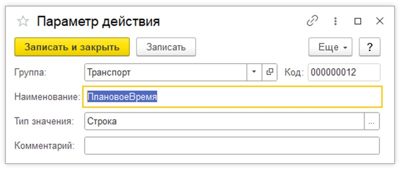
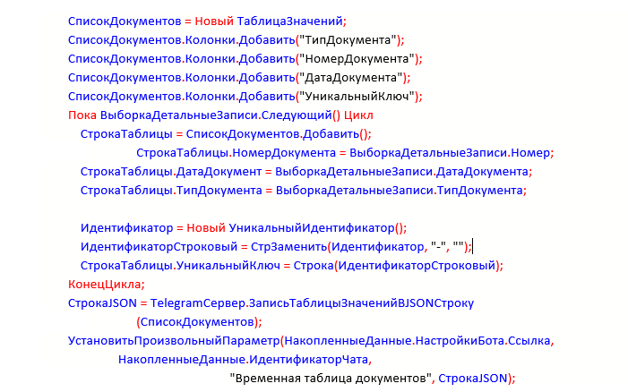
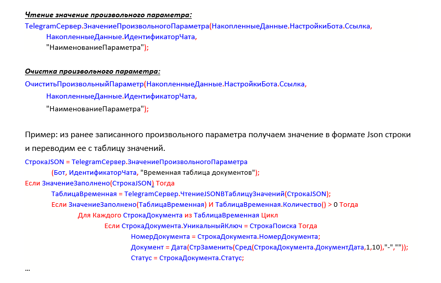

# Вспомогательные объекты, процедуры и функции работы с ними

**Действия – это программный код на языке 1С (весь код выполняется на сервере, другими словами с директивой &НаСервере). Помимо использования стандартного кода 1С работы с информационной базой, в системы телеграм-бот, есть процедуры и функции, которые часто используются при написании действий.**

## Параметры действия

Установить и получить значение параметра действия.

Это можно сделать во вкладке **«Действия над параметрами»**, если значение статическое. Если его необходимо получить программным способом, то используются процедура и функция:

**Важно! Параметры должны быть предварительно созданы в справочнике «Параметры действий».**

```bsl
УстановитьПараметрДействия(НакопленныеДанные.НастройкиБота.Ссылка, НакопленныеДанные.ИдентификаторЧата, ПараметрДействия("НаименованиеПараметра"), ЗначениеПараметра);
```  
записывает значение параметра в справочник если он был заранее создан в справочнике.

```bsl
ЗначениеПараметра(НакопленныеДанные.Параметры, "НаименованиеПараметра");
```
возвращает значение параметра из справочника или «Неопределено» если параметр не задан или не был записан.

***Пример:***  
Создаем в справочнике параметр ПлановоеВремя, т.к. будем передавать туда дату в виде строки, то тип параметра ставим «Строка»



```bsl
ПлановоеВремяСтрокой = «20221031100000»;  
УстановитьПараметрДействия(НакопленныеДанные.НастройкиБота.Ссылка, НакопленныеДанные.ИдентификаторЧата, ПараметрДействия("ПлановоеВремя"), ПлановоеВремяСтрокой);
```
Первые два параметра необходимы, чтобы привязать значение переменной к конкретному боту и чату.

```bsl
…
ДатаДокумента = ЗначениеПараметра(НакопленныеДанные.Параметры, "ПлановоеВремя");
Сообщить (Дата(ДатаДокумента)); // 31.10.2022 11:00:00
```

Таким образом можно сохранять, получать и обрабатывать, значение различных объектов, для необходимых операций.

## Произвольный параметр.

В него можно записать произвольную таблицу значение с набором нужных данных в формате Json строки. Параметр не надо заранее создавать. Это регистр каждая запись содержит данные о боте, чате и значение параметра. 

## Создание и запись значения в произвольный параметр:
```bsl 
СтрокаJSON = TelegramСервер.ЗаписьТаблицыЗначенийВJSONСтроку([ТаблицаЗначений]);  

TelegramСервер.УстановитьПроизвольныйПараметр(НакопленныеДанные.НастройкиБота.Ссылка,
НакопленныеДанные.ИдентификаторЧата, 
"НаименованиеПараметра", СтрокаJSON);
```

- В регистре `TelegramПроизвольныеПараметры` будет создана запись с идентификаторами бота и чата, с названием параметра и записано его значение, в виде `Json` строки, предварительно подготовленной. 


***Пример:***   
Есть запрос, для выборки документов по определенным условиям. Заполняем таблицу значений выбранными данными. Переводим таблицу в Json строку и записываем в произвольный параметр.

```bsl
СписокДокументов = Новый ТаблицаЗначений;
СписокДокументов.Колонки.Добавить("ТипДокумента"); 
СписокДокументов.Колонки.Добавить("НомерДокумента"); 
СписокДокументов.Колонки.Добавить("ДатаДокумента"); 
СписокДокументов.Колонки.Добавить("УникальныйКлюч"); 
  Пока ВыборкаДетальныеЗаписи.Следующий() Цикл
    СтрокаТаблицы = СписокДокументов.Добавить();
      СтрокаТаблицы.НомерДокумента = ВыборкаДетальныеЗаписи.Номер; 
    СтрокаТаблицы.ДатаДокумент = ВыборкаДетальныеЗаписи.ДатаДокумента; 
    СтрокаТаблицы.ТипДокумента = ВыборкаДетальныеЗаписи.ТипДокумента;
    
    Идентификатор = Новый УникальныйИдентификатор(); 
    ИдентификаторСтроковый = СтрЗаменить(Идентификатор, "-", "");
    СтрокаТаблицы.УникальныйКлюч = Строка(ИдентификаторСтроковый); 
  КонецЦикла;
СтрокаJЅОN = TelegramСервер.ЗаписьТаблицыЗначенийBJSONСтроку
    (СписокДокументов);
УстановитьПроизвольныйПараметр(НакопленныеДанные.НастройкиБота.Ссылка,      
     Накопленныеданные.ИдентификаторЧата,
        "Временная таблица документов", СтрокаЈЅОN);
```
**Чтение значение произвольного параметра:**
```bsl
  TelegramСервер.ЗначениеПроизвольногоПараметра(НакопленныеДанные.НастройкиБота.Ссылка,    
    НакопленныеДанные.ИдентификаторЧата,
    "НаименованиеПараметра");
```
Очистка произвольлного параметра:
```1с
  ОчиститьПроизвольныйПараметр(НакопленныеДанные.НастройкиБота.Ссылка, НакопленныеДанные.ИдентификаторЧата,
  "НаименованиеПараметра");
```
Пример: из ранее записанного произвольного параметра получаем значение в формате ЈЅОN строки и переводим ее с таблицу значений.
```bsl
  Строка.ЈЅОN = TelegramСервер.ЗначениеПроизвольногоПараметра
    (Бот, ИдентификаторЧата, "Временная таблица документов");
  Если ЗначениеЗаполнено(Строка.СтрокаЈЅОN) Тогда
    ТаблицаВременная = TelegramСервер.ЧтениеЈЅОNТа6лицуЗначений(СтрокаЈЅОN);
  Если ЗначениеЗаполнено(ТаблицаВременная) И ТаблицаВременная.Количество() > 0 Тогда  
    Для Каждого СтрокаДокумента из ТаблицаВременная Цикл
      Если СтрокаДокумента.УникальныйКлюч = СтрокаПоиска Тогда 
      НомерДокумента = СтрокаДокумента.НомерДокумента;
      Документ = Дата(СтрЗаменить(Сред(СтрокаДокумента.ДокументДатаД,10),"-",""));    
      Статус = СтрокаДокумента.Статус;

```
 
 

## Данные по боту и сеансу

В процессе написания команды могут возникнуть вопросы, где получить дополнительные данные типа идентификатора бота и тому подобное? Для этого существую две специализированные структуры: НастройкиБота  и НакопленныеДанные.  
Первая, как понятно из названия, содержит в себе параметры бота и имеет следующий вид:  

* **Ссылка** - СправочникСсылка.TelegramБоты - ссылка на бота  
* **Наименование** - Строка - наименование бота
* **Токен** - Строка - токен бота
* **ОграниченныйДоступ** - Булево - Если Истина, то у новых пользователей бота ограниченный доступ    

Вторая - содержит данные с информацией по сеансу пользователя и имеет следующие поля:   
  * **ИдентификаторЧата** - Число - идентификатор чата с пользователем.
  * **ИдентификаторОбновления** - Число - идентификатор получения обновления сообщения.
  * **ИдентификаторСообщения** - Число - идентификатор сообщения.
  * **НастройкиБота** - Структура - настройки бота.
  * **Ошибки** - Структура - список ошибок, которые возникли в процессе проверок/действий.
  * **Параметры** - Структура - параметры сеанса текущего пользователя Telegram.
  * **Сообщения** - Структура - список сообщений, которые будут отправлены боту.
  * **ФИОПользователяTelegram** - Строка - ФИО пользователя в профиле Telegram.
  * **ИмяПользователяTelegram** - Строка - имя пользователя в профиле Telegram.
  * **ИмяПрофиля** - Строка - имя профиля Telegram.
  * **ПользовательTelegram** - СправочникСсылка.TelegramПользователи - кто прислал сообщение в Telegram.
  * **Пользователь** - СправочникСсылка.Пользователи - кто прислал сообщение в Telegram.
  * **ТекстСообщения** - Строка - текст последнего сообщения
  * **ТипСообщения** - Перечисления.TelegramТипСообщения - тип последнего сообщения (текст, фото, стикер, документ, аудио, документ, запрос).
  * **ДатаСообщения** - Дата - дата последнего сообщения Telegram.
  * **Сообщение** - ДокументСсылка.TelegramСообщениеВходящее - последнее сообщение Telegram.