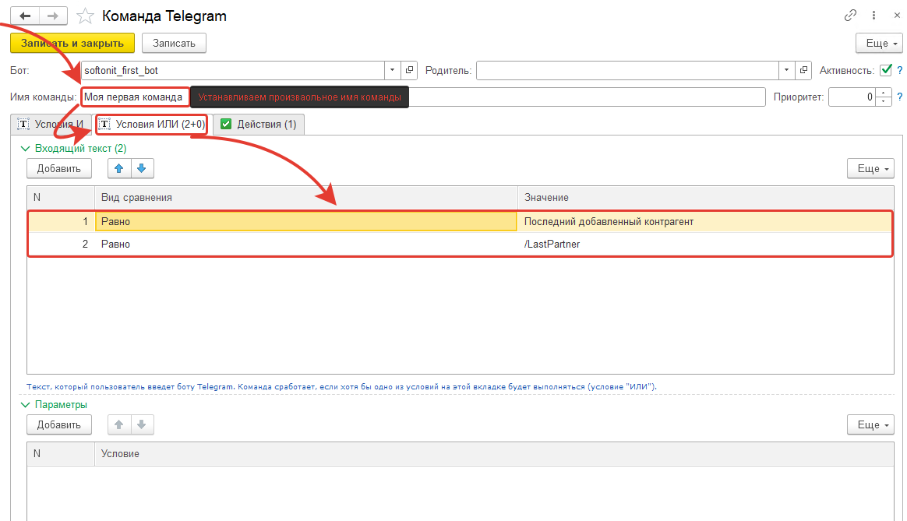
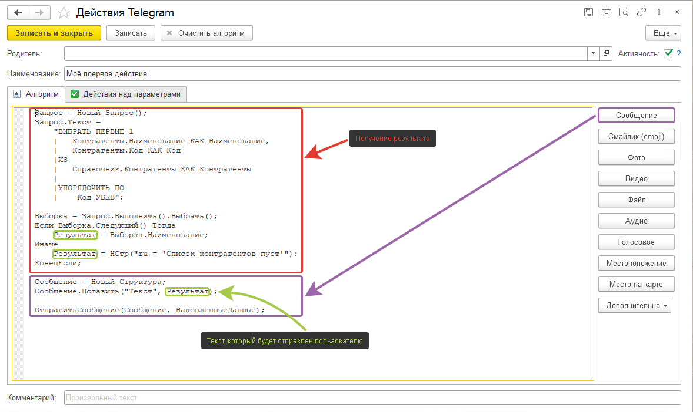
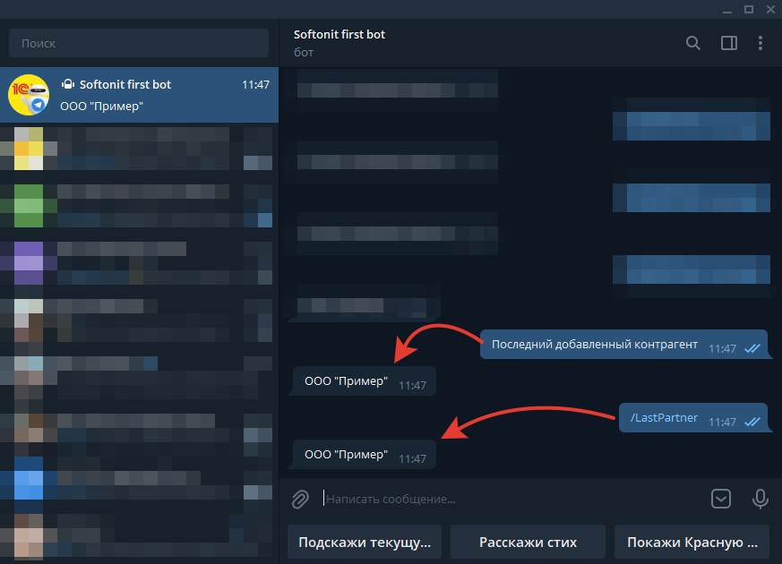

# Добавление собственных команд и действий

## Постановка задачи

Пусть пользователь в Telegram отправит боту команду *"Последний добавленный контрагент"* или *"/LastPartner"* а в ответ на эту команду, 1С вернет наименование элемента справочника "**Контрагенты**", который был добавлен самым последним. Если элементов в справочнике нет, то необходимо просигнализировать об этом.  

## Решение

Для начала необходимо добавить команду. Именно команда определяет какое действие необходимо выполнить. Так как у нас команда может быть введена несколькими способами, то нам надо воспользоваться вкладкой "*Условия ИЛИ*".

Условие "ИЛИ" сработает, когда одно из условий будет выполнено. Теперь перейдем к действиям. При написании алгоритма можно воспользоваться кнопками справа для быстрой вставки кода нужных команд:

Ну и получившийся результат:

## Выводы

Понятно, что это элементарный пример, но наша задача передать суть работы команд и действий. А этот пример как нельзя кстати все это описывает.
Далее в статьях будет описан более подробный механизм работы и  примерм сценария работы.