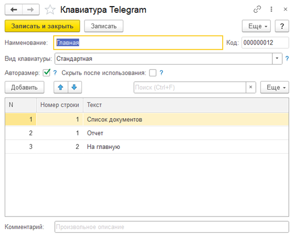
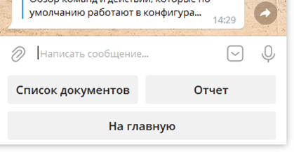
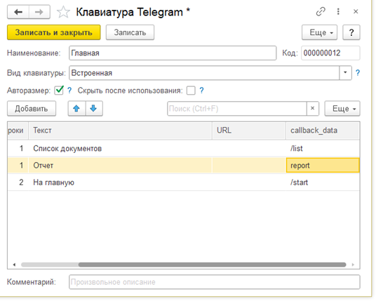
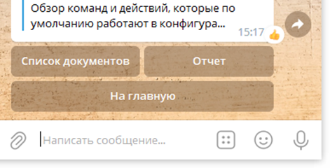
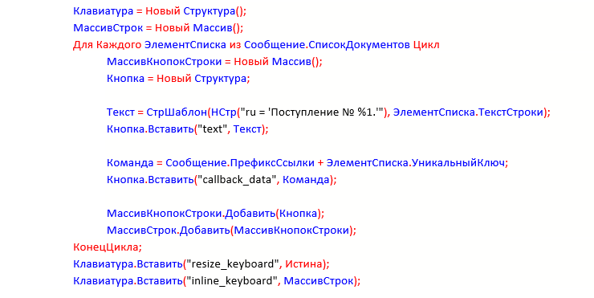
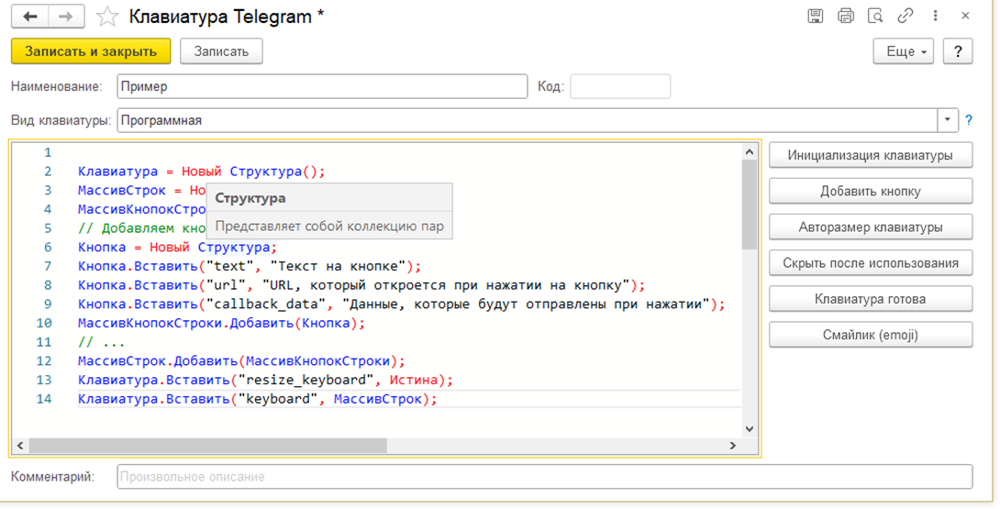

# Использование клавиатур

С каждым сообщением бот может отправлять разный набор кнопок как по количеству, так и по назначению. Кнопки можно расположить непосредственно под сообщением «Встроенная клавиатура» (InlineKeyboardButton), или зафиксировать под тестовым полем для ввода сообщения «Стандартная клавиатура» (KeyboardButton).

## Стандартная клавиатура

Основной плюс – ее не нужно выводить с каждым сообщением. Клавиатура будет оставаться под строкой ввода ответа пока ее не удалить или не заменить на другую.

В окне создания клавиатуры указываем ее имя для обращения к ней при выводе сообщения и добавляем набор кнопок указывая номера строк и текст. Текст будет написан на кнопке, и он же будет отправляться сообщением боту при нажатии на кнопку.




## Встроенная клавиатура
Создание встроенной клавиатуры аналогично стандартной. Добавляются еще два столбца:

**URL** – можно указать ссылку;

**Callback_data** – данные (которые будут возвращены боту при нажатии), поэтому можно дописывать различные идентификаторы и т.п. например «/dok00-00001245», это не портит вид, но можно обработав данные выполнить различные варианты действий например найти документ по номеру;


Нажатие на кнопку не выводит текст в чат. А просто отправляется боту. Используя это, а также в место «Отправить сообщение» - «Редактировать сообщение». Получаем возможность не выводя новый экран Сообщение + Клавиатура, изменить это же.




## Программная клавиатура
Стандартная и встроенная клавиатуры, могут быть созданы с помощью языка 1С. Это необходимо при вариативности создания клавиатуры.

***Пример:***  
 Создание списка документов в виде кнопок, для последующего выбора.

```1c
    Клавиатура = НовыйСтруктура();
    МассивСтрок = НовыйМассив();
    Для Каждого ЭлементСписка из Сообщение.СписокДокументов Цикл
        МассивКнопокСтроки = Новый Массив();
        Кнопка = Новый Структура;

        Текст = Стршаблон(НСтр("ru = 'Поступление No %1.''),ЭлементСписка.ТекстСтроки); 
        Кнопка.Вставить("text", Текст);

        Команда = Сообщение.ПрефиксСсылки + ЭлементСписка.УникальныйКлюч;
        Кнопка.Вставить("callback_data", Команда);

        МассивКнопокСтроки.Добавить(Кнопка);
        МассивСтрок.Добавить(Массив КнопокСтроки); 
    КонецЦикла;
    Клавиатура.Вставить("resize_keyboard", Истина);
    Клавиатура.Вставить("inline_keyboard", МассивСтрок);

```


 В этом примере будет выведен список документов в виде кнопок. Количество кнопок, надписи на кнопках, и команда, формируются динамически в зависимости от состава таблицы значений «СписокДокументов», который в одном из примеров выше был передан клавиатуре из действия.  Сама клавиатура является «Встроенной», об этом говорит признак "inline_keyboard".

Части кода для создания клавиатуры можно быстро добавлять с помощью кнопок на правой панели. В текст кнопок также можно вставлять смайлики.  

 