# Общая схема работы Telegram-бота. 

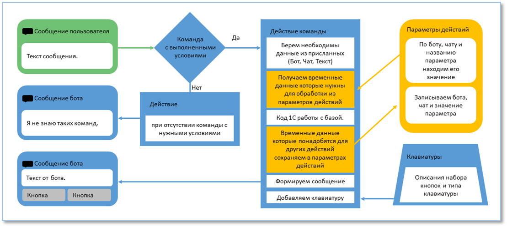

***Пример сценария:***
**Сценарий:** Вывод списка документов со статусом «ожидается», с возможностью выбора нужного документа.


1. Сообщение пользователя – «Ожидается», было отправлено нажатием кнопки `Ожидается`. 

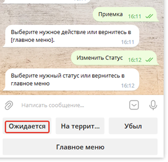

2. В команде «Список транспорта» выполнилось условие. Поэтому начнет выполняться действие «Список транспорт».

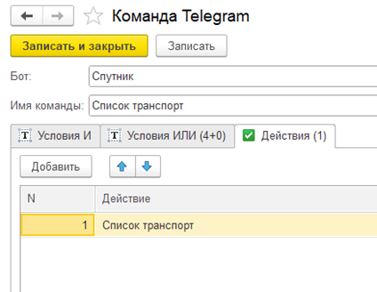

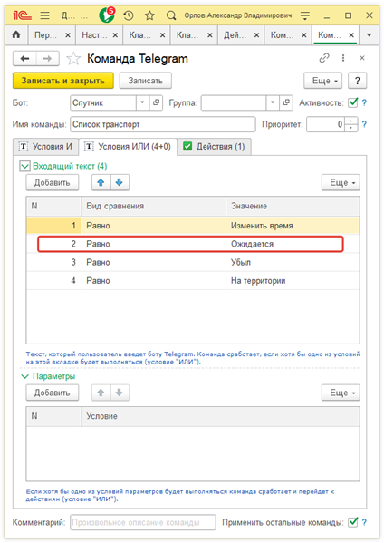

3. **Полный код действия «Список транспорт» в [Приложении №1](static/Application1.docx)**  
*Здесь описаны некоторые блоки:*  

```1c
    Бот = НакопленныеДанные.НастройкиБота.Ссылка; 
```


- Из сообщения полученного ботом берем ссылку на бота.
```1c
    УстановитьПараметрДействия(Бот, НакопленныеДанные.ИндентификаторЧата,
    ПараметрДействия("Статус"), НРег(НакопленныеДанные.ТекстСообщения));
```
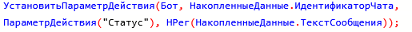

- Записываем значение «ожидается» для параметра действия с именем «Статус».  

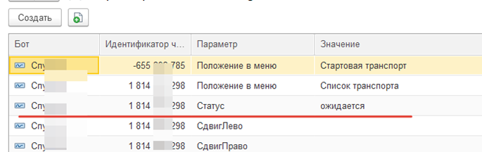

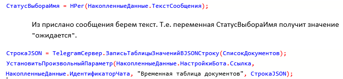
```1c
    СтатусВыбораИмя = Нрег(НакопленныеДанные.ТекстСообщения);
        
    // Из прислано сообщения берем текст. Т.е. переменная СтатусВыбора Имя получит значение "ожидается".

    СтрокаNJSON = TelegramСервер.ЗаписьТаблицыЗначенийВJSONСтроку(СписокДокументов); 
    УстановитьПроизвольныйПараметр(НакопленныеДанные.НастройкиБота.Ссылка,
    НакопленныеДанные.ИдентификаторЧата, "Временная таблица документов", СтрокаJSON);
```

- Собранные данные о списке документов помещаем в регистр для хранения данных в формате `JSON`, чтобы при последующих действиях по новой не собирать информацию с базы, а использовать уже подготовленную.

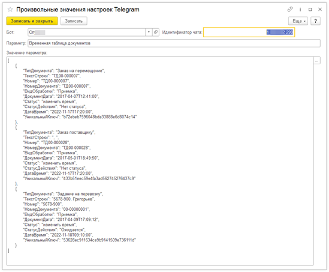

```1c
    Текст = СтрШаблон (НСтр("ги = '<b>Результат поиска ""%1"" (%2):<b>'"), ВидОбработки, СтатусВыбораИмя);
    Сообщение = Новый Структура;
    Сообщение.Вставить("Текст", Текст);
    Сообщение.Вставить("ПрефиксСсылки", "/SetDocс");
    Сообщение.Вставить("Клавиатура", "Список транспорт"); 
    Сообщение.Вставить("СписокДокументов", СписокДокументов); 
    Сообщение.Вставить("РежимАнализаТекста", "HTML");
    ОтправитьСообщение(Сообщение, НакопленныеДанные);
```
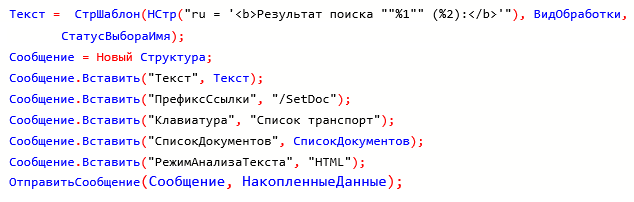

- Формируем данные для отправки сообщения и переходи к созданию клавиатур «Список транспорт», а также «Вид обработки».

4. Создадим клавиатуру «Список транспорт»  
Из переданного в действии Сообщения.СписокДокументов, берем данные (текс, префикс и ключ для команды) и формируем кнопки. Эта клавиатура будет под сообщением.

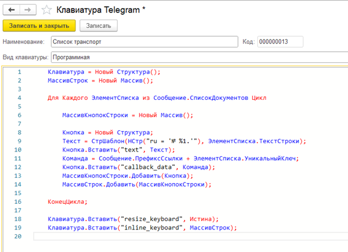

5. Создадим клавиатуру «Вид обработки».  
Эта клавиатура будет расположена под полем вводы ответа.

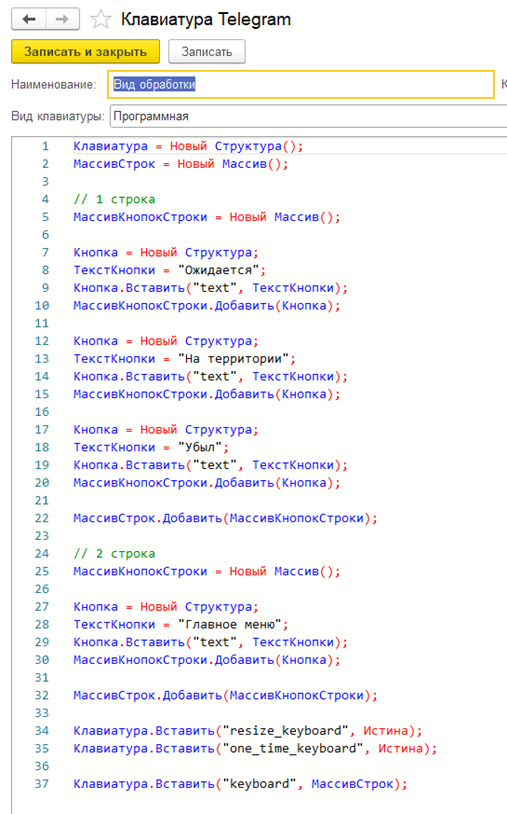
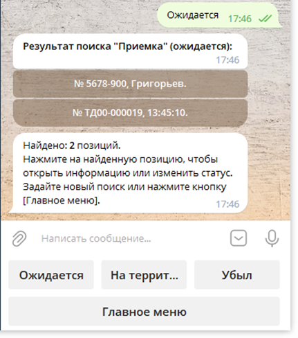