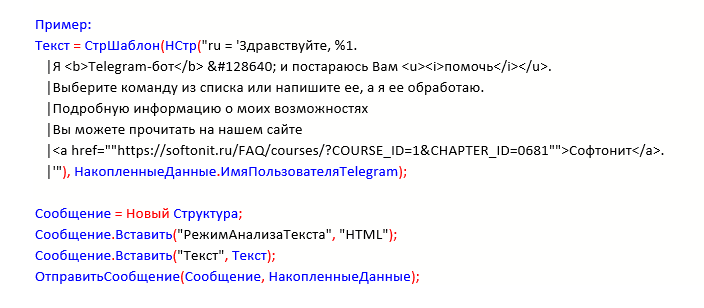
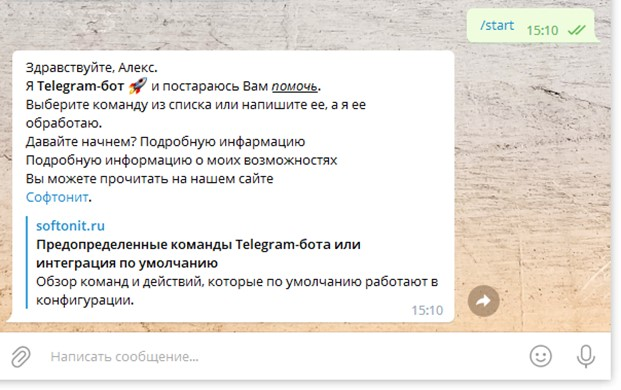

# Оформление текста сообщения

Текст сообщения можно оформить, используя `HTML` или `Markdown` разметку. Возможность оформления сообщения ограничены. Поддерживаются следующие возможности:

|                     |                                   |                   |
|:--------------------|:----------------------------------|:------------------|
|**Жирный**           |\<b>жирный\</b>                    |\*сам ты жирный*   |
|*Курсив*             |\<i>Курсив\</i>                    |\_курсив_          |
|Код                  |\<code>код\</code>                 |\`код`             |
|Подчеркнутый         |\<u>почеркнутый\</u>               |                   |
|Ссылка               |\<a href="softonit.ru">Софтонит</a>|                   |

 Как видно из таблицы набор оформления для HTML шире. Для украшения также можно использовать смайлики (emoji), выбрав из предлагаемого набора или найдя в интернете таблицу кодов и вставив желаемый в текст.

Также в текст можно добавлять команды в формате /[английский текст, цифры, _ и -], при нажатии на такую команду она отправиться боту.

**Пример:**
```1c
    Текст = СтрШаблон(НСтр("ru = 'Здравствуйте, %1.
    Я <<b>Telegram-бот</b> &#128640; и постараюсь Вам <u><i>помочь</i></u>.
        | Выберите команду из списка или напишите ее, а я ее обработаю.
        |Подробную информацию о моих возможностях
        |Вы можете прочитать на нашем сайте
        |<a href=""https://softonit.ru/FAQ/courses/?COURSE_ID=1?&CHAPTER_ID=0681"">Софтонит</a>.
        |'"), НакопленныеДанные. Имя Пользователя Telegram);

    Сообщение = Новый Структура;
    Сообщение.Вставить("РежимАнализаТекста", "HTML"); 
    Сообщение.Вставить("Текст", Текст);
    Отправить Сообщение(Сообщение, НакопленныеДанные);
```


