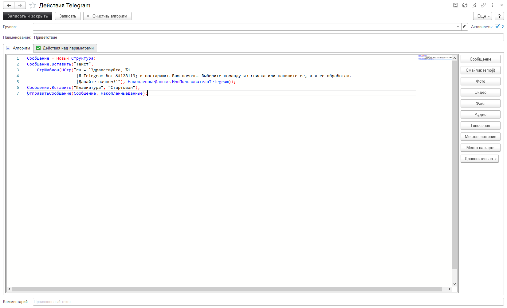

# Описание работы подсистемы конфигурации

## Справочники

### Справочник "Telegram боты"
Справочник предназначен для хранения списка ботов в конфигурации. Т.е. те боты, с которыми мы работаем.  
Имя *бота* и *токен* - это системные реквизиты, которые нам становятся известны при создании [бота](https://softonit.ru/FAQ/courses/?COURSE_ID=1&LESSON_ID=679).  
*Активность* - включает или выключает работу с ботом в конфигурации.
Способ взаимодействия с ботом. Конфигурация может взаимодействовать с ботом двумя способами через `Webhook` (новые сообщения сами отправляются серверу 1С. Этот способ не всегда возможно использовать) и используя **Периодический запрос** (периодический опрос сервера Telegram на предмет новых сообщений). Во избежание сложных настроек и вопросов "почему мы не можем настроить", мы рекомендуем вам использовать периодический запрос.  
*Ограниченный доступ* - флаг, который определяет что делать с новыми пользователями, которые "стучатся" боту и пишут ему сообщения. Если галочка снята, то любой пользователь, который напишет боту автоматически может работать с ботом и полностью использовать все его команды без ограничений. Если флаг установлен, то после того, как пользователь напишет боту, бот запишет в справочники Пользователи Telegram этого пользователя с отключенной галочкой доступ, пользователя уведомит о том, что пока администраторы в 1С не подтвердят, вашу учетную запись, вы не сможете работать с ботом. Мы рекомендуем вам по умолчанию установить галочку. Чтобы отсечь не нужные контакты и обезопасить себя.

Для тех, кто хочет использовать web hook.  
*Адрес* - HTTPS-адрес, на который бот будет отправлять обновления без секретного ключа.  
*Ключ* - секретный ключ, по которому будут идентифицироваться сообщения Telegram.  
*Самоподписанный сертификат* - если вы используете самоподписанный сертификат, то необходимо установить этот флаг.  
*Имя сертификата* - PEM-файл самоподписанного сертификата.
После того, как все для `webhook` настроено, необходимо нажать "Отправить настройки", чтобы бот понял, что вы переходите на `webhook` модель взаимодействия.  
***Важно!*** Нельзя одновременно использовать периодический запрос и `webhook`. Так же обратите внимание, что если Telegram запрещен в вашей стране, то вы не сможете использовать этот способ взаимодействия.

Если все верно настроено, нажмите на кнопку "***Обновить статус***". И вы узнаете какой статус у бота на данный момент.

### Справочник "Пользователи Telegram"

Справочник хранит профили пользователей, которые взаимодействуют с ботами Telegram. Реквизиты этого справочника стандартные для профиля.  
*Наименование* - наименование профиля.  
*Имя профиля* - имя профиля в Telegram.  
Фамилия, Имя - информация из профиля Telegram.  
**(!) Активность** - обратите внимание, что если галочка снята, то пользователь не сможет взаимодействовать с ботом. По умолчанию для новых пользователей для ботов с огранчиенным доступом (см. выше) эта галочка снята.  
*Язык* - язык пользователя установленный в Telegram.  
*Пользователь* - связь со стандартным справочником Пользователи. Позволяет соединить пользователя Telegram и пользователя информационной базы.  
*Табличная часть "Обозначения"* - подстроки, как можно именовать пользователей. К Telegram не имеет никакого отношения. Позволяет в командах использовать сокращения имен пользователей для их идентификации.

### Справочник "Прокси-серверы"

Этот справочник виден только тогда, когда установлена галочка "*Использовать прокси-серверы для отправки и получения данных Telegram*". Возможна работа с серверами прокси по протоколам HTTPS и SOCKS5. Работа с этим справочником необходима для стран в которых запрещен Telegram. Механизмы, которые используются в конфигурации позволяют эффективно вести оценку используемым прокси и использовать только те из них, которые стабильно работают. Ведется статистика использования каждого прокси и каждый из них имеет свою интегрированную оценку (время ответа сервера, успешных/не успешных запросов к прокси).  
Так же стоит иметь ввиду, что есть возможность из формы списка этого справочника открыть сайт с прокси и подобрать себе нужный прокси бесплатно.

### Справочник "Команды"

Этот справочник - сердце подсистемы. Именно он понимает нужно ли выполнять действия команды или нет. Суть справочника проста, если выполняются на закладках "Условия И" и/или "Условия ИЛИ" (или их комбинация), то будут выполнены все действия этой команды в табличной части "*Действия*".

Справочник содержит табличные части:  
*Табличная часть "Входящий текст" на закладке "Условия И"* - табличная часть где проверяется входящий текст, который прислал боту Telegram пользователь. Команда сработает, если сработают все условия в этой табличной части одновременно. Т.е. если в табличной части будут две строки:

То что бы команда выполнилась необходимо чтобы введенный текст содержал обе эти подстроки:  
Т.е. выполнится команда если пользователь введет: "Получить последние остатки" или "Какие последние остатки?". Т.е. одновременно в тексте присутствует слово "получить" и "остатки".

Закладки «Условие ИЛИ» - команда сработает, если сработает хотя бы одно условия в табличной части. Т.е. если в табличной части будут две строки. То, что бы команда выполнилась необходимо чтобы введенный текст содержал хотя бы одну из этих подстрок.  
Пример: команда выполнится если пользователь введет: "Получить остатки" или "Какие остатки?". Т.е. в тексте присутствует слово "остатки", хотя нет "последние".

*Табличная часть "Параметры"* - на этой закладке означает что будут проверены все указанные параметры по условиям и необходимо одновременное выполнение всех условий с параметрами. Что такое параметры и зачем они нужны, мы рассмотрим ниже.

*Табличная часть "Входящий текст"* - Если одновременно есть строки и во входящем тексте "Условия И" и "Условия ИЛИ", то между этими условиями будет поставлено "И".  
*Применить остальные команды* - флаг, который означает, что если команда будет выполнена, то больше никакие команды не нужно применять.

**Пример для понимания как это все работает.** Пользователь написал нашему боту: "Сколько сейчас времени?".  
В "Условиях И" есть строка "содержит - сколько", в "Условиях ИЛИ" две строки: "равно - времени", "равно - время".  
Анализ текста будет произведен так (*ВходящийТекст СОДЕРЖИТ "сколько"*) И (*ВходящийТекст РАВНО "времени" ИЛИ ВходящийТекст РАВНО "время"*). Если все верно для входящего текста, то будут выполнены команды.

*Табличная часть "Действия" *- действия, которые будут выполнены, если будут выполнены условия И/ИЛИ с их параметрами.

### Справочник "Действия"
То, что будет выполнено, если условия в команде будут выполнены. Действия могут быть какими угодно. Что-то записать в информационную базу, что-то ответить пользователю, выполнить какую-то обработку данных и т.п.. Действия выполняются в порядке их следования в таблице сверху вниз  
*Активность* - выполнять действие или нет.  
*Алгоритм* - код на языке 1С, который может что-то выполнить.  
Табличная часть "*Действия над параметрами*" - что сделать над параметрами. Параметры рассмотрим ниже.

Пример действия приветствия пользователя.

Этот код вернет отправит пользователю текстовое сообщение и отобразит клавиатуру с наименованием "Стартовая". Справа есть панель с быстрыми действиями, которые могут быть выполнены. После того, как воспользуемся кнопкой справа, в текст алгоритма вставиться текст, который позволит что-то отправить пользователю. Вдаваться в подробности программирования в этой части мы не будем, но подчеркнем, что эта возможность есть и она "базовая", т.е. эта возможность доступна пользователям соответствующих редакций.  

### Справочник "Условия"

Здесь мы можем задать условия параметров действий. Суть этого справочника в следующем. Для каждого чата есть какой-то контекст его выполнения. Пользователь, который пишет команды может использовать сразу несколько связанный между собой условий. Примером такого поведения является текущее местоположение в древовидном меню. В самом начале мы в главном меню. Щелкнули на кнопку "Инфо по клиенту", мы перешли на следующий уровень и там свое меню. И т.д. Или какие-то другие данные связанные между собой в цепочку.
Пример: если мы захотим ввести новое задание, нам необходима тема, описание, файлы вложения и т.д. Без введенной темы, мы не можем ввести описание.

Чтобы добавить в команду проверку параметров, необходимо подготовить условия проверки в справочнике «Условия». Закладка «Проверка параметров» содержит таблицу с условиями проверки значения параметра. Строки в таблице имеют логическую связку «И». С помощью галочки «Есть программная проверка» можно добавить произвольный программой код на языке 1С, который при выполнении вернет переменной Результат значение Истина или Ложь.  
**Параметры**- это переменные, которые хранятся для каждого пользователя подсистемы. Эти переменные можно задействовать при программировании своих команд и действий.

Табличная часть "Проверка параметров" - список проверяемых реквизитов.

### Справочник "Emoji"
Это справочник смайликов. По умолчанию они не хранятся в информационной базе. Их можно подгрузить. Смысл такой, что каждый такой смайлик по сути это символ в `Unicode-кодировке`. В справочнике можно увидеть какому изображению какой код соответствует.

### Справочник "Клавиатуры"
Это кнопки, которые добавляются либо внизу над вводимым текстом нового сообщения, либо в режиме `"inline"`, т.е. прям в выводимом боту/ботом сообщении.
Элементы этого справочника могут быть либо заданы жестко, либо программно, либо вообще это скрытая клавиатура.

### Документы "Входящие сообщения"
То, что присылают нам пользователи. История об этих действиях сохраняется и мы всегда можем проанализировать когда, кто и что присылал боту. Установив константу "*Срок хранения сообщений Telegram*" в настройках можно задать сколько дней хранить эти сообщения.

### Документы "Исходящие сообщения"
То, что отправляет конфигурация боту Telegram. История об этих действиях сохраняется и мы всегда можем проанализировать когда, кто и что присылал боту. Установив константу "*Срок хранения сообщений Telegram*" в настройках можно задать сколько дней хранить эти сообщения.