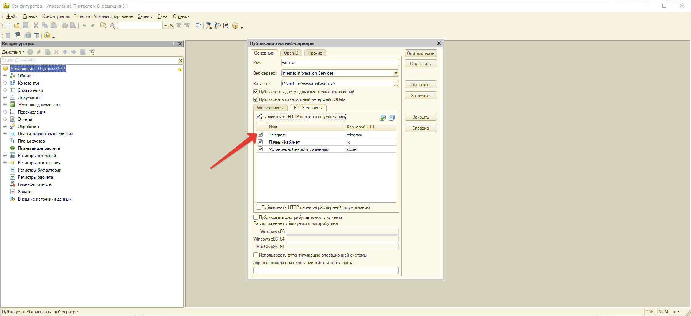
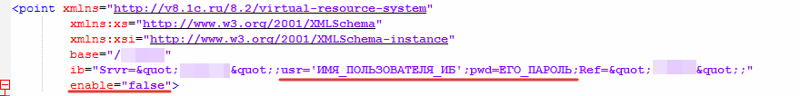
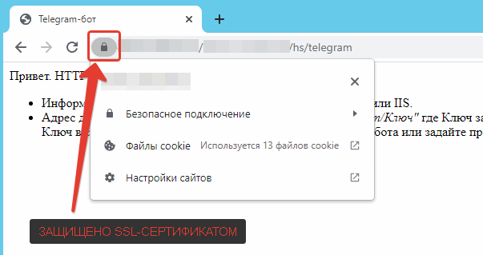
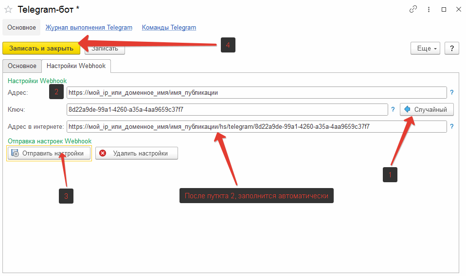

# Настройка Webhook

1. Для настройки вебхука необходимо запустить конфигуратор от имени администратора и выполнить публикацию базы на веб сервере, с включенным HTTP-сервисом «Telegram», более подробнее про публикацию базы 1С на веб-сервере IIS по ссылке [Публикация базы на 1с сервере](https://softonit.ru/blog/articles/it/publishing-1C-databases-on-the-IIS-web-server/)



2. Проверяем подключение к HTTP-сервису по адресу [http://имя_хоста/имя_публикации/hs/telegram](http://имя_хоста/имя_публикации/hs/telegram), если переход выполняется успешно, но требует авторизацию переходим к пункту **3**, если при переходе не требует авторизации и открывается страница со словами «Привет. HTTP-сервис Telegram НЕ доступен по этому адресу» переходим к пункту **4**, а в любом ином случае возвращаемся к первому пункту и пытаемся опубликовать правильно.

3. Если веб-публикация требует авторизации, необходимо «вшить» логин и пароль в файл публикации, для сервера IIS это делается следующем образом:
    1. Находим папку с нашей web-публикацией, по умолчанию она находится в *C:\inetpub\wwwroot\имя_публикации*, в моем случае “*webka*”.
    2. Делаем копию данной папки, и называем ее любым другим именем, например “*webka_webhook*”.
    3. В скопированной папке открываем файл «default.vrd» любым текстовым редактором производим изменения файла:  
        * *Если имеется тэг <ws>, полностью, со всем содержимым удаляем его.*  
        * *В теге <httpServices> удаляем все наполнение, кроме <service name="Telegram" rootUr………./>*  
        * *В теге <point> вносим изменения, как на скриншоте, логин и пароль для подключения к ИБ, и параметр enable=”false” запретит подключение в режиме тонкого клиента.*

        * **Сохраняем изменения*
        
    4. Открываем “Диспетчер служб IIS” в древе подключений находим нашу публикацию (в моем случае “webka”), щелкаем по ней правой кнопкой мыши и нажимаем «Добавить приложение»
    5. В открывшемся окне заполняем физический путь, до скопированного каталога (в моем случае «C:\inetpub\wwwroot\webka_webhook»), заполняем псевдоним «webka_webhook», нажимаем «ОК» и в диспетчере IIS перезапускаем сервер.
    6. Проверяем переход по новой публикации, в моем случае <http://имя_хоста/webka_webhook/hs/telegram>, если не запрашивает авторизацию и пишет «Привет. HTTP-сервис Telegram НЕ доступен по этому адресу», переходим к пункту 4, иначе еще раз внимательно проходим пункт 3.


4. Для работы с вебхука, необходимо иметь постоянный адрес к базе через интернет, а именно фиксированное доменное имя или белый IP. Пытаемся подключится к публикации через интернет <http://внешний> IP или доменное имя/имя публикации/hs/telegram, если переход удался переходим к следующему пункту, иначе проверяем настройки маршрутизатора.
5. Очень важно, чтобы Ваше соединение было защищено SSL сертификатом, иначе телеграм-сервер не захочет взаимодействовать. *Если не знаете как получить сертификат бесплатно, воспользуйтесь данной инструкцией* [Настройка IIS](https://softonit.ru/blog/articles/it/Installing-creating-free-Lets-Encrypt-certificate-in-IIS-Windows-for-1C-Company/, "Внешняя ссылка")
6. Пробуем перейти к публикации по HTTPS протоколу <https://внешний> IP или доменное имя/имя публикации/hs/telegram, обращаем на наличие SSL сертификата, он не должен быть просроченным или вызывать подозрения…



7. Публикация готова! Осталось перенастроить бота, для этого, в 1с открываем справочник «Боты», выбираем необходимого бота и изменяем параметр «Способ взаимодействия с ботом» на «Вебхук»
8. После изменения способа взаимодействия, появится вкладка «Настройки Webhook», нажимаем на нее и выполняем шаги в последовательности указанной на скришоте
>



9. Ускорение работы для файловых баз 
 - Для того, чтобы добиться максимально быстрого отклика Telegram-бота необходимо поддерживать сеанс вебхука в 1С, рекомендуется создать .bat файл с данным текстом:
```bat
:beginning
    curl "http://localhost:88/uit_webhook/hs/telegram"
    cls
    ping -n 1 -w 10000 192.168.254.254> NUL
goto beginning
```
-  Замените адрес "...localhost:88/uit_webhook..." на свой локальный адрес расположения вебхука. Добавьте .bat файл в планировщик заданий, чтобы он запускался при запуске компьютера.

**Настройка вебхука завершена!**