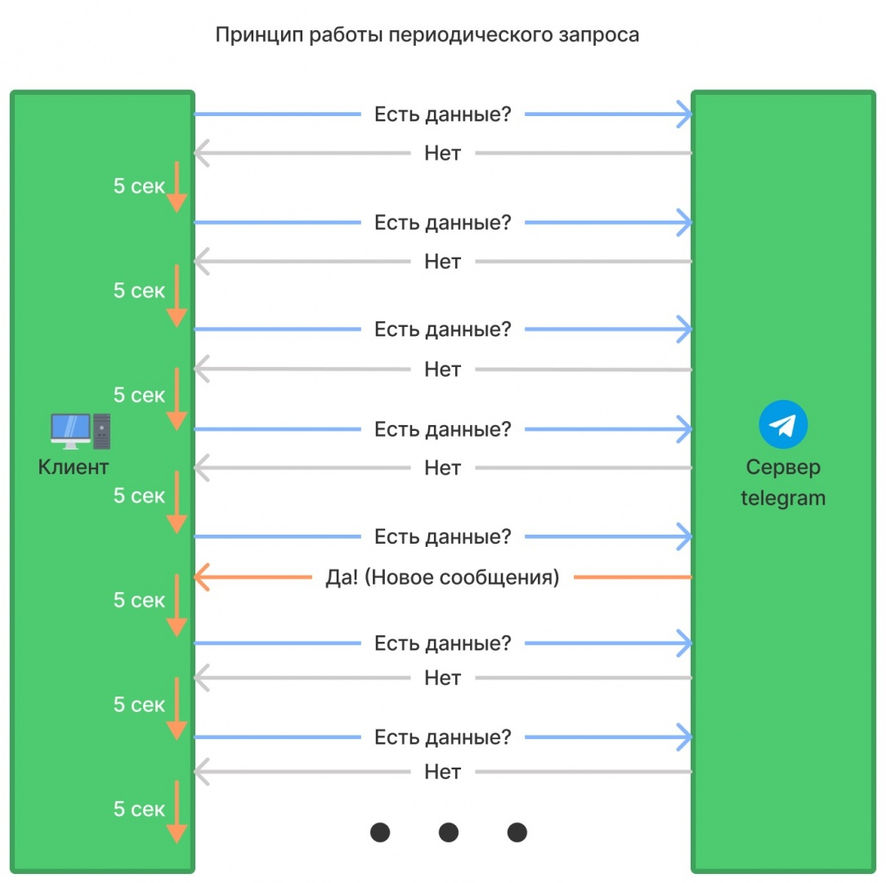
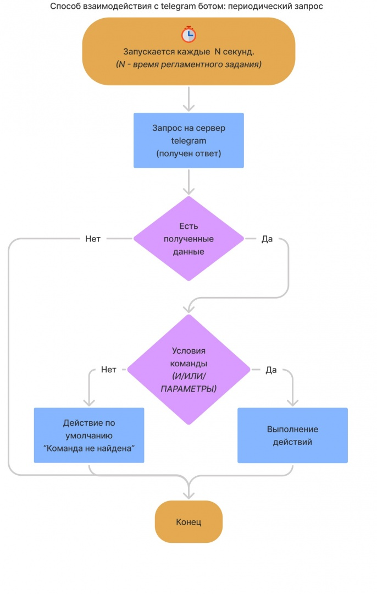
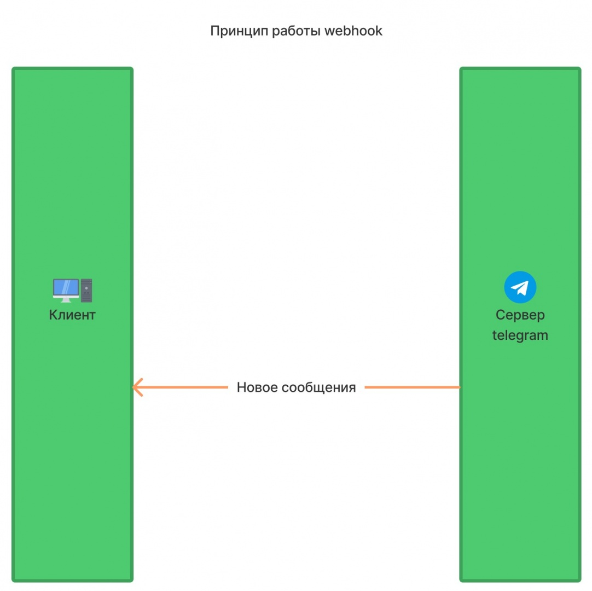
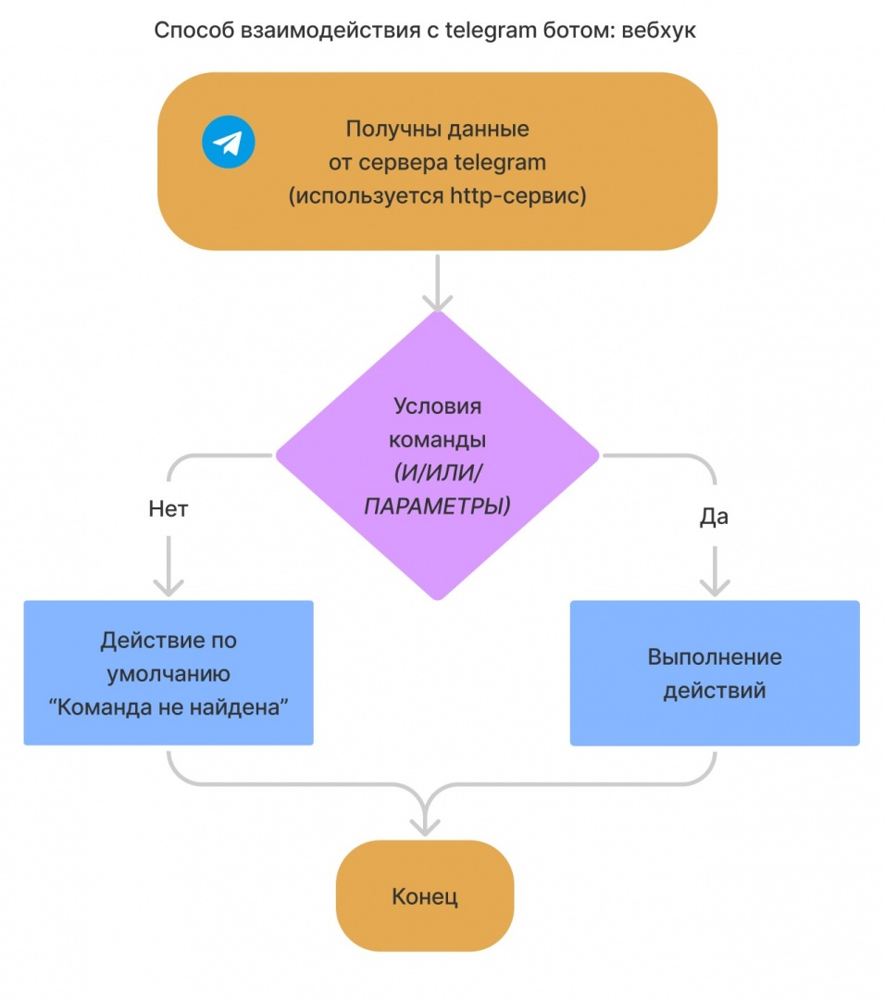

# Способы взаимодействия с ботом

## На текущий момент есть три способа взаимодействия с telegram-ботами:

1) Периодический запрос на основе регламентного задания (Стабильный способ для серверных баз)
2) Периодический запрос на основе обработки "Периодическое обновление телеграм" (Стабильный способ для файловых баз)
3) Вебхук (`webhook`) самый быстрый и эффективный способ, но его тяжело настроить (поэтому рекомендуем использовать первые два способа).

Ниже приведены схемы работы периодического запрос и `webhook`.

**Периодический запрос:**

## Webhook: 
 Важно обратить внимание, на то, что сервер телеграм будет работать только с портами 80, 88, 443, 8443

