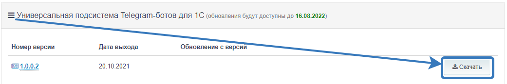

# Обновление подсистемы

## Проверка и установка обновлений "Универсальная подсистема Telegram-ботов для 1С"
Для проверки обновлений перейдите в настройки подсистемы telegram *"Telegram -> Настройки Telegram"*

Если в окне настроек есть блок обновлений, как на скриншоте, значит у Вас установлена не последняя версия и есть возможность обновиться. 

Нажимаем на гиперссылку "Скачать обновление" и попадаем на наш сайт по пути *"Техподдержка" - "Личный кабинет"*. Если у Вас есть действующая подписка, тогда в разделе *"Универсальная подсистема Telegram-ботов для 1С"* на ряду с последней версией нажмите кнопку "Скачать"

`Во избежание непредвиденных обстоятельств, перед началом установки обновления подсистемы рекомендуем создать резервную копию базы.`

После скачивания распаковываем архив и запускаем установщик обновления файл setup.exe. Следуем указаниям установщика и устанавливаем файл обновления в выбранный Вами каталог.

Следующим шагом откроем конфигуратор базы, установим выделение корня структуры конфигурации и перейдем в раздел "Конфигурация" - "Поддержка" - "Обновить конфигурацию".
В появившемся окне "Обновление конфигурации" необходимо выбрать источник обновления конфигурации. Выбираем второй вариант "Выбор файла обновления" и нажимаем "Далее".

Далее необходимо указать в проводнике файл обновления, который был установлен ранее. Обычно он расположен в каталоге с номером версии обновления, например, 1_0_0_3\1Cv8.cfu. 

Далее появится окно "Обновление конфигурации", в котором нам сообщают о возможности обновления. Соглашаемся и нажимаем "ОК".

Далее в окне сравнения необходимо обязательно убрать галочку с корневого элемента конфигурации в колонке "Основная конфигурация".

Далее в этом же окне необходимо нажать кнопку "Действия" и в выпадающем меню выбрать пункт "Отметить по подсистемам новой конфигурации поставщика".
В появившемся окне отмечаем галочку только напротив подсистемы "Telegram", как показано на скриншоте ниже. Далее нажимаем кнопку "Установить" и "Выполнить".

После этого сохраняем настройки объединения в любой каталог на жестком диске. Далее в окне "Настройки правил поддержки" необходимо активировать чек-бокс "Объект редактируется с сохранением поддержки" как на скриншоте ниже.

После чего получаем сообщение об успешном завершении.

Последним шагом нужно обновить основную конфигурацию (F7), чтобы применить изменения. После этого можно продолжить пользоваться подсистемой.

