# Установка подсистемы

!!!
Во избежание непредвиденных обстоятельств, перед началом установки подсистемы рекомендуем создать резервную копию базы.`
!!!
## Установка дистрибутива "Универсальная подсистема telegram-ботов для 1С"
После создания копии основной базы приступим к скачиванию и установки дистрибутива подсистемы. На нашем сайте в разделе "Личный кабинет" - "Временные ссылки и дистрибутивы" скачиваем полный дистрибутив "Универсальная подсистема telegram-ботов для 1С". После скачивания открываем и распаковываем архив, в котором находятся необходимые для установки файлы. Запускаем файл setup.exe, который запустит процесс установки дистрибутива. В мастере установки нажимаем "Далее" и дожидаемся окончания. После можно переходить к следующему шагу.

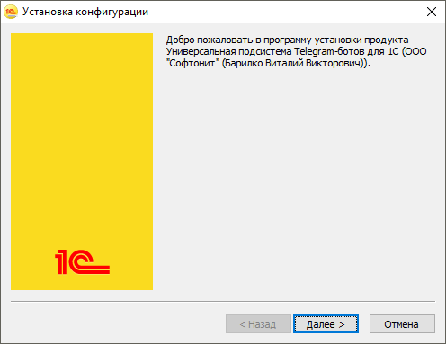

## Разрешение вносить изменения в состав конфигурации
После того как дистрибутив подсистемы установлен продолжим установку. Откроем конфигурацию в режиме "Конфигуратор". Если Ваша конфигурация полностью типовая, тогда напротив корня структуры конфигурации увидим замок с желтым кубом. Это означает, что конфигурация находится на поддержке. Если же замка нет, тогда можно перейти к следующему шагу установки. Чтобы разрешить вносить изменения перейдем в раздел "Конфигурация" - "Поддержка" - "Настройка поддержки".

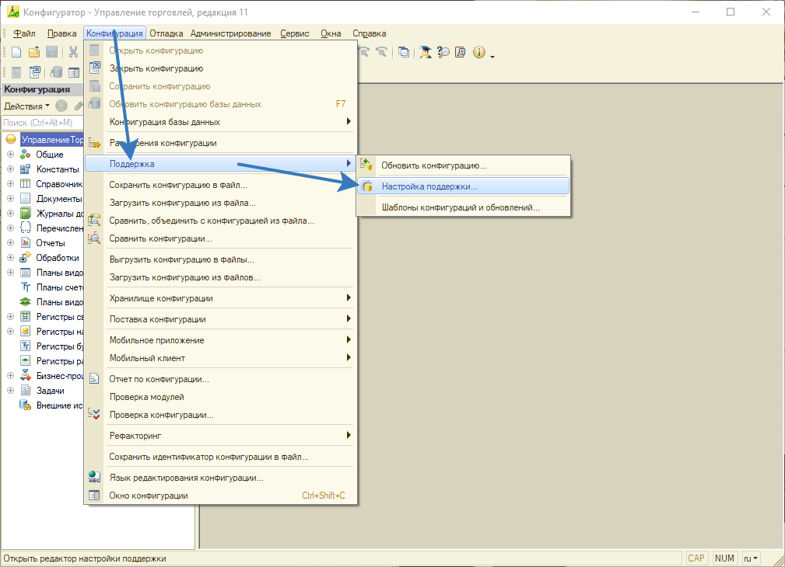

В открывшемся окне "Настройка поддержки" необходимо включить возможность изменения конфигурации, путем нажатия на одноименную кнопку.

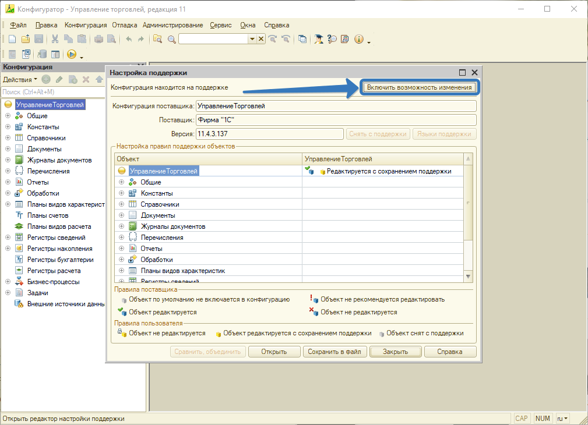

Перед Вами появится предупреждение конфигуратора, которое сообщает о том, что включение возможности изменения приведет к невозможности выполнять обновления конфигурации полностью автоматически. Нажимаем "Да", так как далее настроим правило в котором конфигурация будет редактироваться с сохранением поддержки.

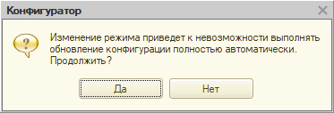

После нажатия кнопки "Да" откроется следующее окно "Настройка правил поддержки", в котором отмечаем два чек-бокса "Объект поставщика редактируется с сохранением поддержки. После этого закрываем настройки поддержки и можем наблюдать, что напротив корня структуры конфигурации исчез замок и остался только желтый куб. Это говорит нам о том, что теперь можно вносить изменения в состав конфигурации и при этом она не будет снята с поддержки.

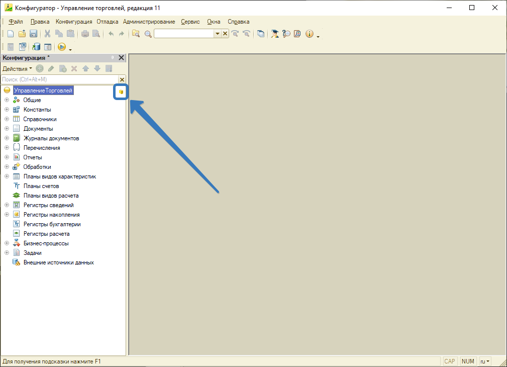 

## Добавление подсистемы в конфигурацию
После того как стала доступна возможность изменения конфигурации, перейдем в раздел "Конфигурация" и выберем пункт меню "Сравнить, объединить с конфигурацией из файла". 

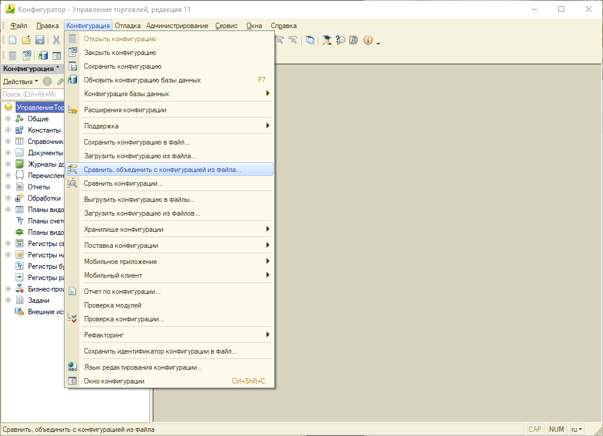

Откроется проводник Windows, в котором необходимо выбрать файл подсистемы в формате 1Cv8.cf. По умолчанию (если при установки дистрибутива не изменялся путь) файл подсистемы расположен: **C:\Users\Имя_пользователя\AppData\Roaming\1C\1cv8\tmplts\SoftOnIT\telegram**
Далее будет предложено поставить подсистему на поддержку, нажмем "Да".

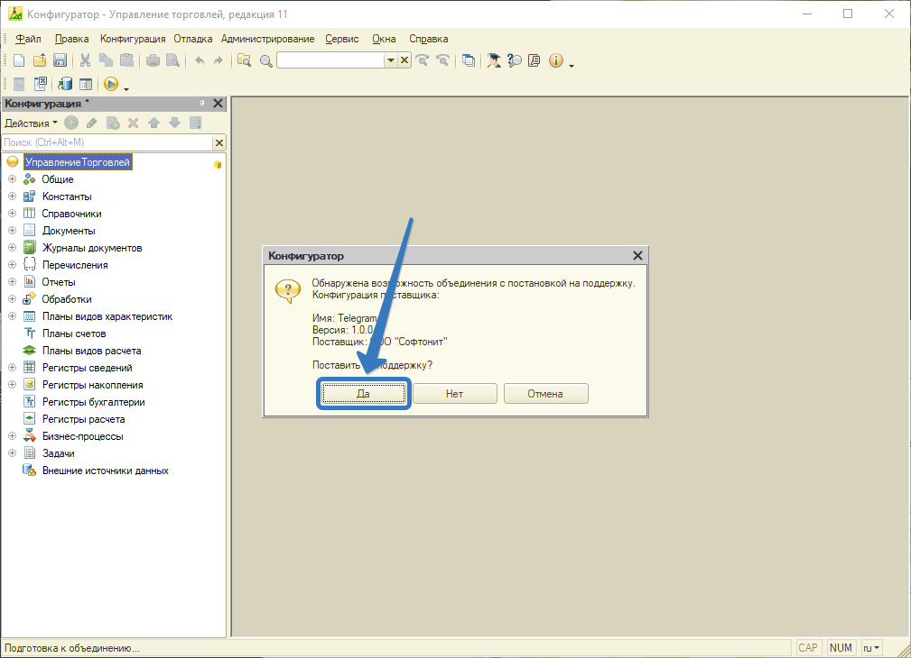

Далее в окне сравнения необходимо обязательно убрать галочку с корневого элемента конфигурации в колонке "Основная конфигурация".

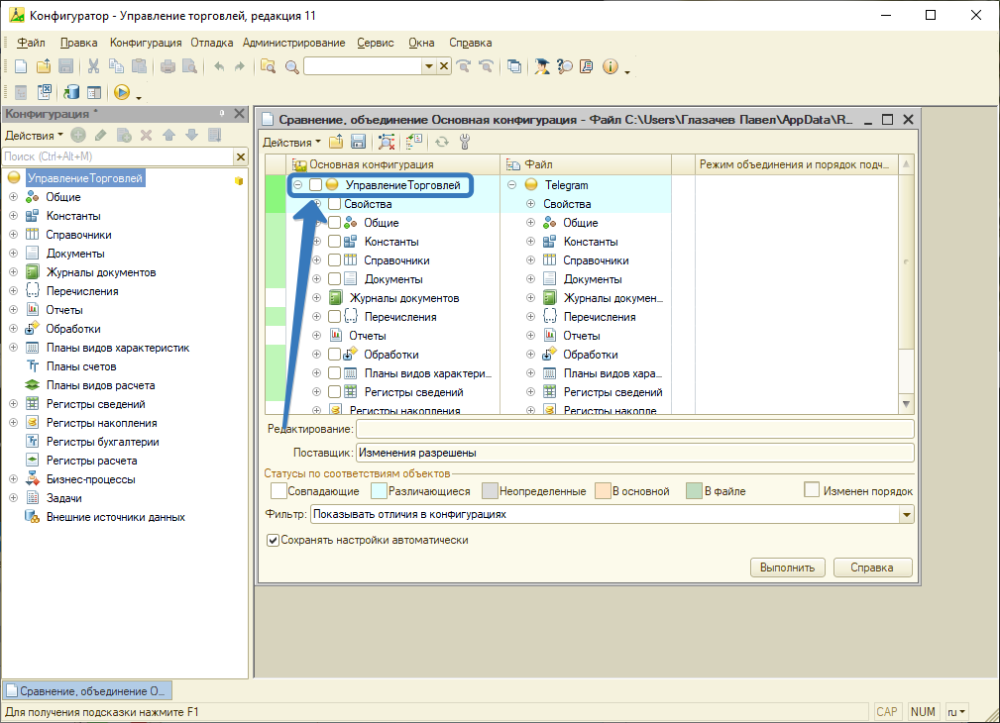

Далее в этом же окне необходимо нажать кнопку "Действия" и в выпадающем меню выбрать пункт "Отметить по подсистемам файла". В появившемся окне отмечаем галочку только напротив подсистемы "Telegram", как показано на скриншоте ниже. Далее нажимаем кнопку "Установить".

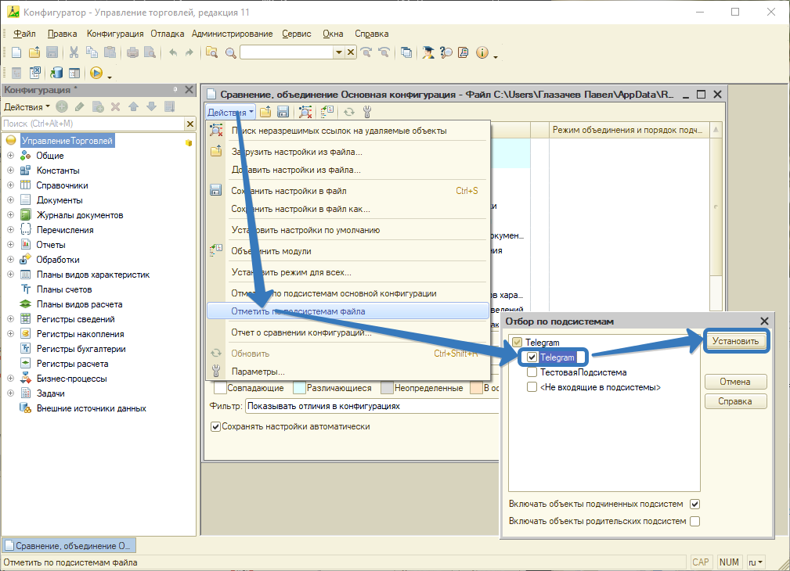

Далее необходимо развернуть дерево конфигурации и перейти "Общие" - "Подсистемы". Напротив строки "Telegram" необходимо проверить наличие установленной галочки, если галки нет, устанавливаем и жмем "Выполнить".

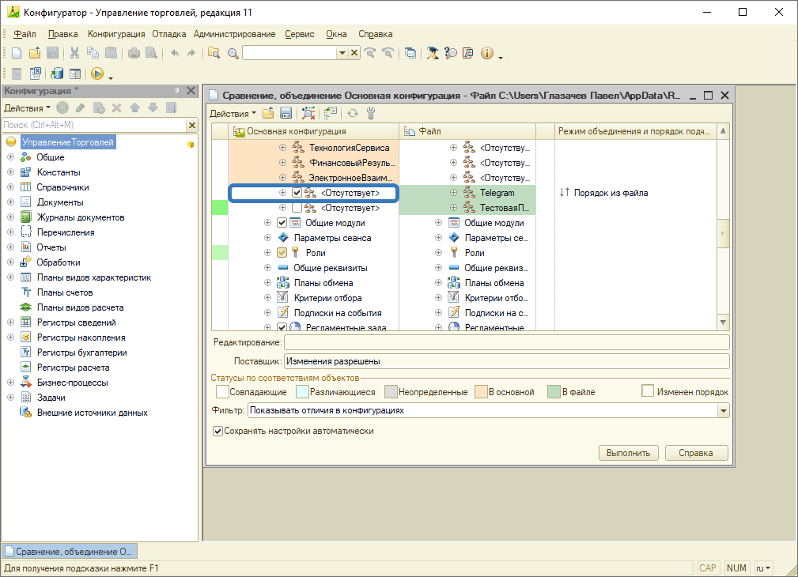

Следом появится еще одно окно "Настройка правил поддержки", где нужно отметить галочку "Объект редактируется с сохранением поддержки" в разделе "Новые объекты поставщика"  и нажать "ОК".

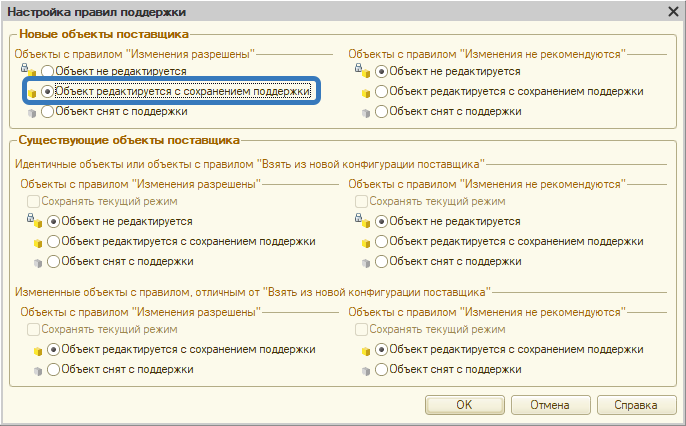

После этого остается только выбрать каталог на диске, куда сохранить настройки объединения и дождаться объединения. Результатом успешной установки подсистемы будет диалоговое окно с сообщением об удачном завершении. 

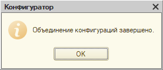

Последним шагом нужно обновить основную конфигурацию (F7), чтобы применить изменения. После этого можно приступить к настройке подсистемы.

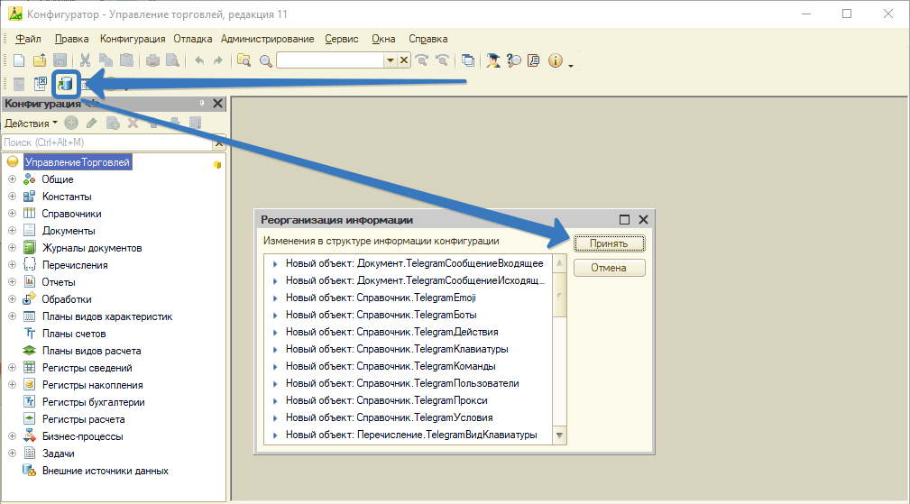